# Concepts

How dura.stream works, from the smallest unit up.

<p align="center">
  
</p>

A store holds a SQLite table of stream metadata and a set of open streams. Each
stream owns its own file handles and an in memory index into one `.log` file on
disk.

## The record: length, checksum, payload

<p align="center">
  
</p>

Every record written to disk is wrapped in a small fixed header before the
payload:

```
[4 bytes: length][4 bytes: crc32][payload bytes]
```

On read we walk the file frame by frame and check two things before trusting a
record: that the file actually holds the promised bytes (else it was a torn
write from a crash), and that the CRC matches (else it is corrupt). We stop at
the first record that fails either check. Everything before that point is
guaranteed intact, so a crash mid write never corrupts what came before it.

## The stream: one append only file

A stream is a single `.log` file plus an in memory index.

- **Write** appends the framed record and flushes it to disk. Durable when it
  returns.
- A record's position is its **offset**, a 0 based logical index. `next_offset`
  is the record count and where the next append lands. That single integer is
  the whole resume contract: a reader remembers one number to pick up exactly
  where it left off.
- **Batch** many records into one `append_many`, which pays a single `fsync` for
  the whole group.
- On **open** we scan the log, rebuild the index, and if the tail is torn or
  corrupt we truncate it back to the last good record so future appends stay
  contiguous. The scan uses `mmap`, so a large log is not read fully into memory.

## The store: metadata and open streams

The store is the layer above individual streams. It owns:

- a SQLite `meta.db` (WAL mode) tracking which streams exist, their content type,
  and their open or closed state,
- a `streams/` directory holding one `.log` file per stream,
- an in memory map of already open streams, so repeated `open`/`create` calls for
  the same name reuse the same object and file handles.

`create` is idempotent. A new stream fsyncs its directory entry so it survives a
crash. Calling `create` again with a different `content_type` raises, so a
mismatch fails loud instead of silently returning the wrong type.

## Durability boundary

The `fsync` is the durability line. After `append` (or `append_many`) returns,
the bytes are on disk. Batching moves the line to once per batch instead of once
per record, which is where the large speedup comes from, with no change to the
guarantee once the call returns.

## On disk layout

```
data/
  meta.db                 SQLite: name, content_type, closed, created_at
  streams/
    orders.log            append-only frames: [u32 len][u32 crc32][payload]...
```

CRC is `zlib.crc32` (CRC-32/ISO-HDLC).
